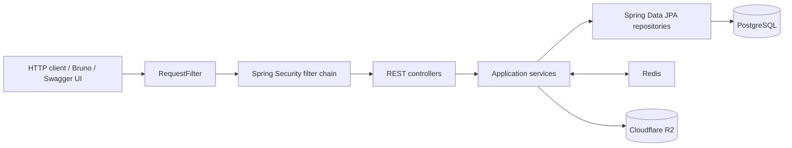
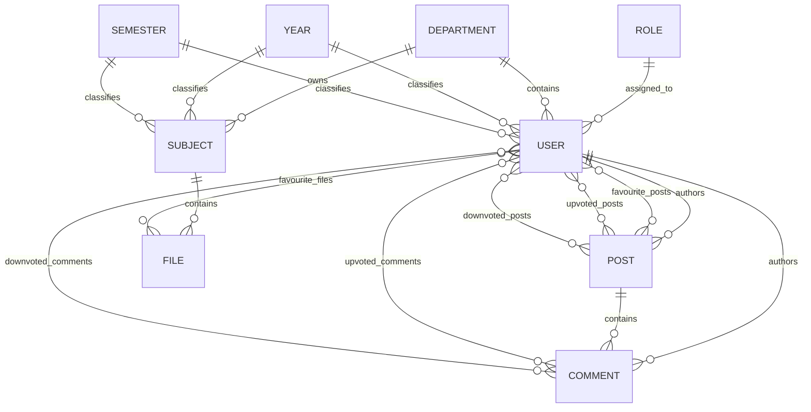

# Documan

Documan is a Java 21 / Spring Boot REST API for organizing academic subjects and files and for supporting a small community around posts, comments, votes, favourites, users, and roles.

The current repository is a single backend service. It stores application data in PostgreSQL, uses Redis as an explicit read-through cache for selected entities, and stores uploaded file objects in Cloudflare R2 through the AWS S3 SDK.

> This README documents the code as it exists today. The security and production-readiness limitations near the end are part of the current implementation and should be reviewed before deploying the service outside a trusted development environment.

## Contents

- [Feature inventory](#feature-inventory)
- [Technology stack](#technology-stack)
- [Architecture](#architecture)
- [Repository layout](#repository-layout)
- [Domain model](#domain-model)
- [Request and persistence flow](#request-and-persistence-flow)
- [Local setup](#local-setup)
- [Configuration](#configuration)
- [Database initialization](#database-initialization)
- [API reference](#api-reference)
- [Request payloads](#request-payloads)
- [Caching](#caching)
- [File storage](#file-storage)
- [Security model](#security-model)
- [Observability and logging](#observability-and-logging)
- [Build and development tooling](#build-and-development-tooling)
- [Containerization and CI](#containerization-and-ci)
- [Current limitations and known issues](#current-limitations-and-known-issues)
- [Testing status](#testing-status)
- [License](#license)

## Feature inventory

### Users

- Create a user associated with a department, academic year, semester, and the default regular role.
- Fetch a user by numeric ID.
- Fetch a user by username.
- Update a user's profile and academic associations.
- Delete a user.
- Persist username, email, name, password, role, department, year, semester, account flags, and timestamps.
- Model a user's posts, comments, favourite files, favourite posts, and post/comment votes.

### Academic catalog

- Read departments.
- Read academic years.
- Read semesters.
- Read roles.
- Create, read, update, delete, and list subjects.
- Filter subjects by department, year, and semester.
- Associate each subject with one department, year, and semester.
- Mark subjects as lab and/or theory subjects.

### Posts and comments

- Create, read, update, delete, and list posts.
- List posts created by a user.
- Create, read, update, delete, and list comments.
- List comments by user or post.
- Upvote or downvote posts and comments.
- Remove post and comment votes.
- Automatically remove the opposite vote when switching between upvote and downvote.
- Favourite and unfavourite posts.

### Files

- Upload multipart files to a Cloudflare R2 bucket.
- Generate object keys from a random UUID plus a normalized original filename.
- Store file metadata in PostgreSQL.
- Return a public object URL assembled from the configured R2 public URL.
- List files associated with a subject.
- Delete an object from R2 by object key.
- Include a lower-level service method for uploading profile pictures to a separate user-data bucket; no controller currently exposes it.

### Infrastructure and operations

- PostgreSQL persistence through Spring Data JPA and Hibernate.
- Redis-backed cache for users, subjects, posts, and comments.
- PostgreSQL and Redis development containers.
- Swagger UI and OpenAPI generation through springdoc.
- Spring Boot Actuator and Prometheus registry dependencies.
- OpenTelemetry Java agent in the production container image.
- Nix flake development shell with Java 21, Maven, Gradle, k6, and supporting tools.
- Spotless formatting with Google Java Format.
- A pre-commit hook that runs formatting.
- Bruno request collection containing examples for the exposed application endpoints.
- GitLab CI jobs for manually building and pushing development, test, and production images.

## Technology stack

| Area | Current implementation |
| --- | --- |
| Language | Java 21 |
| Framework | Spring Boot 3.3.4 |
| Web | Spring MVC / `spring-boot-starter-web` |
| Persistence | Spring Data JPA, Hibernate |
| Database | PostgreSQL 17 in the provided development Compose file |
| Cache | Spring Data Redis, Redis 7.4 in the provided development Compose file |
| Object storage | Cloudflare R2 via AWS SDK for Java S3 2.29.6 |
| API documentation | springdoc OpenAPI 2.6.0 |
| Security dependency | Spring Security through Spring Cloud Azure Active Directory 5.16.0 |
| Serialization | Jackson with Java Time support |
| Boilerplate reduction | Lombok |
| Metrics | Spring Boot Actuator and Micrometer Prometheus registry |
| Tracing in container | OpenTelemetry Java agent 2.9.0 |
| Build | Maven |
| Formatting | Spotless Maven plugin and Google Java Format |
| Local environment | Nix flake / direnv, or a manually installed JDK and Maven |
| API client examples | Bruno |
| Load-test tooling | k6; one basic user endpoint script is included |
| CI | GitLab CI |

## Architecture

Documan uses a conventional layered monolith:



### Layers

| Layer | Package | Responsibility |
| --- | --- | --- |
| Application entry point | `com.documan` | Sets the JVM default timezone to UTC and starts Spring Boot. |
| HTTP controllers | `com.documan.controllers` | Maps `/api/v1/**` requests, translates service `Optional` results to HTTP responses, and catches broad exceptions. |
| Services | `com.documan.service` | Implements entity creation/update logic, association checks, caching, voting, favourites, and R2 operations. |
| Repositories | `com.documan.dao` | Extends `JpaRepository` and defines a few native lookup queries. |
| Entities | `com.documan.entity` | Defines the JPA model, relationships, indexes, timestamps, and JSON visibility rules. |
| Configuration | `com.documan.config` | Creates the Redis template and Cloudflare R2-compatible S3 client. |
| Security/filtering | `com.documan.security` | Configures the stateless permit-all security chain and logs incoming requests. |

### Codebase size

The current source tree contains:

- 44 Java source files.
- 9 JPA entities.
- 9 Spring Data repositories.
- 12 service classes.
- 9 REST controllers.
- 44 controller endpoint mappings.
- 48 Bruno request files.
- No automated test source files.

## Repository layout

```text
.
├── APIs/                         Bruno API collection and development environment
├── SQL/                          Seed data, pgcrypto setup, and database loader
├── k6-scripts/                   Basic k6 request script
├── src/main/java/com/documan/
│   ├── config/                   Redis and Cloudflare R2 client configuration
│   ├── controllers/              REST API controllers
│   ├── dao/                      Spring Data JPA repositories
│   ├── entity/                   JPA entities and relationships
│   ├── security/                 Security chain and request logging filter
│   ├── service/                  Business, cache, vote, favourite, and R2 services
│   └── DocumanApplication.java   Application entry point
├── src/main/resources/
│   ├── application.yml           Base application configuration
│   ├── application-documan.yml   Checked-in development configuration template
│   └── logback.xml               Console and profile-specific file logging
├── Dockerfile                    Multi-stage application image
├── redis-database.yml            PostgreSQL and Redis development services
├── schema.sql                    Generated PostgreSQL schema snapshot
├── extract-schema-sql.sh         Regenerates schema.sql from the running container
├── pom.xml                       Maven build and dependency configuration
├── flake.nix                     Reproducible development shell
├── Makefile                      Formatting and pre-commit setup commands
└── .gitlab-ci.yml                Manual image build/push jobs
```

## Domain model



### Entity details

#### `User`

Database table: `documan_user`

Important fields:

- `id`: integer identity primary key.
- `username`: required and unique.
- `password`: required and write-only in JSON responses.
- `firstName`, `lastName`, `email`: profile fields; email is required and unique.
- `acceptedTermsOfService`: required boolean with a default of `false`.
- `isVerified`: required boolean with a default of `false`.
- `canPost`, `canComment`: required booleans with defaults of `false`.
- `dateCreated`: Hibernate creation timestamp.
- `dateLastInteracted`: Hibernate update timestamp.
- Eager many-to-one associations to `Role`, `Department`, `Year`, and `Semester`.
- Lazy associations to authored posts/comments, favourites, and votes.

New users are always assigned role ID `1`, which the seed data defines as `regular`.

#### `Role`

- Unique role name.
- One-to-many relationship with users.
- Seeded roles are `regular`, `moderator`, and `admin`.
- Promotion and demotion are determined by comparing numeric role IDs, not by role names or an explicit rank field.

#### `Department`

- Unique department name.
- One-to-many relationships with users and subjects.
- Seed data includes six engineering departments.

#### `Year`

- Unique string value stored in the database column `year`.
- One-to-many relationships with users and subjects.
- Seed data includes years `I` through `IV`.

#### `Semester`

- Unique semester name.
- One-to-many relationships with users and subjects.
- Seed data includes semesters `I` and `II`.

#### `Subject`

- Long identity primary key.
- Name and code.
- `isLab` and `isTheory` flags.
- Required many-to-one relationships to department, year, and semester.
- One-to-many relationship with files.

#### `File`

- Integer identity primary key.
- Original display name.
- R2 object key in `objectName`.
- Public URL in `objectURL`.
- File size in bytes.
- Creation and update timestamps.
- Required many-to-one relationship to a subject.
- Many-to-many relationship with users through `favourite_files`.

The file-favourite relationship is modeled but is not currently exposed by a controller or service operation.

#### `Post`

- Integer identity primary key.
- Required title, description, and content text.
- Creation and update timestamps.
- Required author relationship to a user.
- One-to-many relationship with comments.
- Many-to-many user relationships for favourites, upvotes, and downvotes.

#### `Comment`

- Integer identity primary key.
- Required text content.
- Creation and update timestamps.
- Required relationships to a post and user.
- Many-to-many user relationships for upvotes and downvotes.

### Join tables

The JPA model uses these many-to-many join tables:

| Join table | Meaning |
| --- | --- |
| `favourite_files` | Files favourited by users |
| `favourite_posts` | Posts favourited by users |
| `upvoted_posts` | Post upvotes |
| `downvoted_posts` | Post downvotes |
| `upvoted_comments` | Comment upvotes |
| `downvoted_comments` | Comment downvotes |

## Request and persistence flow

For a typical entity lookup:

1. `RequestFilter` logs the HTTP method, URL, headers, and query parameters.
2. The Spring Security chain permits the request and uses no HTTP session.
3. A controller reads query parameters and/or a request body.
4. The controller calls a service.
5. For cached entity-by-ID operations, the service checks Redis first.
6. On a cache miss, the service reads through a JPA repository from PostgreSQL and writes the entity to Redis.
7. The controller converts a present `Optional` to HTTP `200`.
8. A missing result is normally translated to `400` or `404`, depending on the endpoint.
9. An exception caught by the controller is translated to `500` with a generic text response.

Create and update operations generally verify referenced entities, copy selected request fields into a managed entity, save through JPA, and then set or replace the relevant Redis entry.

## Local setup

### Prerequisites

Choose one development environment:

- JDK 21 and Maven installed locally, or
- Nix with flakes enabled.

Also install:

- Docker with Compose support.
- PostgreSQL client tools if you intend to run `SQL/load-data.sh`.
- A Cloudflare R2 account, bucket, public bucket URL, endpoint, access key ID, and secret access key. The R2 client bean is constructed during application startup.

### Option 1: Nix development shell

The repository includes `.envrc` with `use flake`.

```bash
direnv allow
```

Alternatively:

```bash
nix develop
```

The shell provides Java 21, Maven, Gradle, k6, Lombok support, and native build utilities.

### Option 2: Local JDK and Maven

Confirm the expected versions:

```bash
java -version
mvn -version
```

Java 21 is required by the Maven build.

### Start PostgreSQL and Redis

```bash
docker compose -f redis-database.yml up -d
```

The development services expose:

| Service | Host port | Username | Development password |
| --- | ---: | --- | --- |
| PostgreSQL | `5432` | `root` | `password` |
| Redis | `6379` | n/a | `password` |

These are development-only defaults and must not be reused for a shared or production environment.

### Create the local secrets profile

The Maven default profile filters `application.yml` so that Spring activates `documan-secrets`. That profile file is intentionally ignored by Git.

Create it from the checked-in template:

```bash
cp src/main/resources/application-documan.yml \
  src/main/resources/application-documan-secrets.yml
```

Edit `application-documan-secrets.yml` and replace every Cloudflare R2 placeholder with real values. Keep credentials only in the ignored secrets file or inject them through a secret manager/environment variables.

At minimum, configure:

```yaml
cloudflare:
  r2:
    endpoint: https://<account-id>.r2.cloudflarestorage.com
    access-key-id: <access-key-id>
    secret-access-key: <secret-access-key>
    files-bucket: <files-bucket>
    files-bucket-public-access-url: https://<public-files-host>
    user-bucket: <user-data-bucket>
```

The copied template already points PostgreSQL and Redis at the provided local containers.

### Run the application

```bash
mvn spring-boot:run
```

The default server port is `8080`.

Useful local URLs:

| Resource | URL |
| --- | --- |
| API base | `http://localhost:8080/api/v1` |
| Swagger UI | `http://localhost:8080/swagger-ui/index.html` |
| OpenAPI JSON | `http://localhost:8080/v3/api-docs` |
| Actuator health | `http://localhost:8080/actuator/health` |

The Prometheus registry dependency is present, but the repository does not explicitly expose the Prometheus actuator endpoint. Add the appropriate `management.endpoints.web.exposure.include` configuration before relying on `/actuator/prometheus`.

## Configuration

### Profiles

| Profile/file | Purpose |
| --- | --- |
| `application.yml` | Sets the application name, port, and active profile token populated by Maven resource filtering. |
| `application-documan.yml` | Checked-in local configuration template with placeholder R2 values and development database/cache values. |
| `application-documan-secrets.yml` | Expected default local profile containing real local credentials; ignored by Git. |

The Maven `default` profile is active by default and sets:

```xml
<spring.profiles.active>documan-secrets</spring.profiles.active>
```

You can override Spring's active profile at runtime:

```bash
mvn spring-boot:run -Dspring-boot.run.profiles=documan
```

The checked-in `documan` profile still contains non-functional R2 placeholders, so it is primarily a template unless values are overridden externally.

### Application properties used by the code

| Property | Consumer | Purpose |
| --- | --- | --- |
| `cloudflare.r2.endpoint` | `CloudflareR2Config` | R2 S3-compatible endpoint URI |
| `cloudflare.r2.access-key-id` | `CloudflareR2Config` | Static S3 access key |
| `cloudflare.r2.secret-access-key` | `CloudflareR2Config` | Static S3 secret |
| `cloudflare.r2.files-bucket` | `CloudflareR2Service` | Bucket used for subject files |
| `cloudflare.r2.files-bucket-public-access-url` | `CloudflareR2Service` | Base URL used to build public file URLs |
| `cloudflare.r2.user-bucket` | `CloudflareR2Service` | Bucket used by the unexposed profile-picture upload method |
| `spring.datasource.*` | Spring Boot / HikariCP | PostgreSQL connection and pool |
| `spring.data.redis.*` | Spring Boot | Redis connection |
| `spring.servlet.multipart.max-file-size` | Spring MVC | Per-file upload limit; currently `25MB` |
| `server.tomcat.*` | Embedded Tomcat | Queue and thread settings |
| `server.compression.*` | Embedded server | JSON response compression |
| `spring.jpa.hibernate.ddl-auto` | Hibernate | Currently `update` |
| `spring.jpa.show-sql` | Hibernate | SQL logging; currently enabled in the template |

### Current server and pool tuning

The checked-in development template configures:

- Tomcat accept queue: `200`.
- Tomcat maximum threads: `400`.
- Tomcat minimum spare threads: `20`.
- Hikari maximum pool size: `50`.
- Hikari minimum idle connections: `10`.
- Hikari connection timeout: `30s`.
- Hikari idle timeout: `30s`.
- Hikari maximum connection lifetime: `30m`.
- Hikari leak detection threshold: `2s`.
- Hikari auto-commit: disabled.
- Response compression for JSON responses of at least `1024` bytes.

These values are not environment-specific in the repository and should be load-tested before production use.

## Database initialization

Hibernate is configured with `ddl-auto: update`, so application startup creates or updates tables from the entity mappings.

After the schema exists, load the included reference and sample data:

```bash
cd SQL
./load-data.sh
```

The script:

1. Enables PostgreSQL `pgcrypto`.
2. Inserts roles.
3. Inserts academic years.
4. Inserts semesters.
5. Inserts departments.
6. Inserts sample subjects.
7. Inserts a sample user.
8. Inserts sample posts.
9. Inserts sample comments.

The loader uses the development PostgreSQL credentials from `redis-database.yml`.

### Seeded reference data

Roles:

1. `regular`
2. `moderator`
3. `admin`

Years:

1. `I`
2. `II`
3. `III`
4. `IV`

Semesters:

1. `I`
2. `II`

Departments:

- Computer Science Engineering
- Electronics and Communication Engineering
- Information Technology
- Mechanical Engineering
- Electrical Engineering
- Civil Engineering

The seed scripts are plain inserts and are not idempotent. Running them repeatedly against the same database can violate unique constraints or duplicate non-unique sample data.

### Schema snapshot

`schema.sql` is a PostgreSQL schema-only dump generated by:

```bash
./extract-schema-sql.sh
```

That script runs `pg_dump` inside the container named `postgres`.

The entity classes are the active runtime schema source because Hibernate uses `ddl-auto: update`. The checked-in `schema.sql` is a snapshot and currently differs from parts of the latest `File` entity, so it should be regenerated before treating it as authoritative.

## API reference

All application endpoints are currently unauthenticated and use query parameters rather than path parameters for IDs.

The API generally returns persisted entity JSON directly. Associations marked with `@JsonIgnore` are omitted, and the user password is write-only.

### Users

Base path: `/api/v1/user`

| Method | Path | Parameters | Body | Behavior |
| --- | --- | --- | --- | --- |
| `GET` | `/api/v1/user` | `userId` | none | Fetch one user by ID, using Redis read-through caching. |
| `GET` | `/api/v1/user/username` | `username` | none | Fetch one user directly by username. |
| `POST` | `/api/v1/user` | `departmentId`, `yearId`, `semesterId` | User JSON | Create a user with role ID `1`. A supplied body ID causes rejection. |
| `PUT` | `/api/v1/user` | `userId`, `departmentId`, `yearId`, `semesterId` | User JSON | Replace selected user profile fields and academic associations. |
| `DELETE` | `/api/v1/user` | `userId` | none | Delete a user and its `USER{id}` cache entry. |

There is no endpoint to list all users or fetch a user by email, although `UserService` contains an email lookup method.

### Posts

Base path: `/api/v1/post`

| Method | Path | Parameters | Body | Behavior |
| --- | --- | --- | --- | --- |
| `GET` | `/api/v1/post` | `postId` | none | Fetch one post by ID, using Redis read-through caching. |
| `GET` | `/api/v1/post/all` | none | none | List all posts. |
| `GET` | `/api/v1/post/user` | `userId` | none | List posts authored by a user. |
| `POST` | `/api/v1/post` | `userId` | Post JSON | Create a post for an existing user. |
| `PUT` | `/api/v1/post` | `postId` | Post JSON | Update title, description, and content. |
| `POST` | `/api/v1/post/vote` | `userId`, `postId`, `voteType` | none required | Apply `upvote` or `downvote`; removes the opposite vote. |
| `POST` | `/api/v1/post/vote/remove` | `userId`, `postId`, `voteType` | none required | Remove an `upvote` or `downvote`. |
| `POST` | `/api/v1/post/favourite` | `userId`, `postId` | none required | Add the user to the post's favourites if absent. |
| `POST` | `/api/v1/post/favourite/remove` | `userId`, `postId` | none required | Remove the user from the post's favourites. |
| `DELETE` | `/api/v1/post` | `postId` | none | Delete a post. See the cache invalidation issue under known limitations. |

`voteType` is case-sensitive and only accepts `upvote` or `downvote`.

### Comments

Base path: `/api/v1/comment`

| Method | Path | Parameters | Body | Behavior |
| --- | --- | --- | --- | --- |
| `GET` | `/api/v1/comment` | `commentId` | none | Fetch one comment by ID, using Redis read-through caching. |
| `GET` | `/api/v1/comment/all` | none | none | List all comments. |
| `GET` | `/api/v1/comment/user` | `userId` | none | List comments authored by a user. |
| `GET` | `/api/v1/comment/post` | `postId` | none | List comments attached to a post. |
| `POST` | `/api/v1/comment` | `userId`, `postId` | Comment JSON | Create a comment for an existing user and post. |
| `PUT` | `/api/v1/comment` | `commentId` | Comment JSON | Update comment content. |
| `POST` | `/api/v1/comment/vote` | `userId`, `commentId`, `voteType` | none required | Apply `upvote` or `downvote`; removes the opposite vote. |
| `POST` | `/api/v1/comment/vote/remove` | `userId`, `commentId`, `voteType` | none required | Remove an `upvote` or `downvote`. |
| `DELETE` | `/api/v1/comment` | `commentId` | none | Delete a comment and its cache entry. |

### Subjects

Base path: `/api/v1/subject`

| Method | Path | Parameters | Body | Behavior |
| --- | --- | --- | --- | --- |
| `GET` | `/api/v1/subject` | `subjectId` | none | Fetch one subject by ID, using Redis read-through caching. |
| `GET` | `/api/v1/subject/all` | none | none | List all subjects. |
| `GET` | `/api/v1/subject/semester` | `departmentId`, `yearId`, `semesterId` | none | List matching subjects after verifying all three reference rows exist. |
| `POST` | `/api/v1/subject` | `departmentId`, `yearId`, `semesterId` | Subject JSON | Create a subject and cache it. |
| `PUT` | `/api/v1/subject` | `subjectId`, `departmentId`, `yearId`, `semesterId` | Subject JSON | Update the subject and its associations. |
| `DELETE` | `/api/v1/subject` | `subjectId` | none | Delete the subject and its cache entry. |

### Files

Base path: `/api/v1/file`

| Method | Path | Parameters | Body | Behavior |
| --- | --- | --- | --- | --- |
| `GET` | `/api/v1/file/subject` | `subjectId` | none | Return the files associated with a subject. |
| `POST` | `/api/v1/file` | `subjectId` | multipart field `file` | Upload to R2 and save file metadata in PostgreSQL. |
| `DELETE` | `/api/v1/file` | `objectUID` | none | Delete the object from R2 by key. It does not delete the metadata row. |

### Roles

Base path: `/api/v1/role`

| Method | Path | Parameters | Body | Behavior |
| --- | --- | --- | --- | --- |
| `GET` | `/api/v1/role` | `roleId` | none | Fetch a role by ID. |
| `GET` | `/api/v1/role/all` | none | none | List all roles. |
| `GET` | `/api/v1/role/user` | `userId` | none | Fetch a user's role. |
| `PUT` | `/api/v1/role/promote` | `userId`, `roleId` | none required | Set a role only when the target role ID is greater than the current role ID. |
| `PUT` | `/api/v1/role/demote` | `userId`, `roleId` | none required | Set a role only when the target role ID is lower than the current role ID. |

### Departments

Base path: `/api/v1/department`

| Method | Path | Parameters | Behavior |
| --- | --- | --- | --- |
| `GET` | `/api/v1/department` | `departmentId` | Fetch one department. |
| `GET` | `/api/v1/department/all` | none | List all departments. |

### Years

Base path: `/api/v1/year`

| Method | Path | Parameters | Behavior |
| --- | --- | --- | --- |
| `GET` | `/api/v1/year` | `yearId` | Fetch one year. |
| `GET` | `/api/v1/year/all` | none | List all years. |

### Semesters

Base path: `/api/v1/semester`

| Method | Path | Parameters | Behavior |
| --- | --- | --- | --- |
| `GET` | `/api/v1/semester` | `semesterId` | Fetch one semester. |
| `GET` | `/api/v1/semester/all` | none | List all semesters. |

### Typical status behavior

| Status | Current usage |
| --- | --- |
| `200 OK` | Successful reads, creates, updates, deletes, votes, and favourites |
| `400 Bad Request` | Missing related entities, invalid vote type, invalid create/update state, or some empty list results |
| `404 Not Found` | Missing entities on selected read/delete endpoints |
| `500 Internal Server Error` | Broad controller exception handler; usually returns a generic text message |

Creation currently returns `200`, not `201 Created`, and deletion returns the deleted entity or a success string rather than `204 No Content`.

## Request payloads

### Create a user

```http
POST /api/v1/user?departmentId=1&yearId=1&semesterId=1
Content-Type: application/json
```

```json
{
  "username": "student1",
  "firstName": "Ada",
  "lastName": "Lovelace",
  "email": "ada@example.com",
  "password": "replace-with-a-secure-password"
}
```

The service ignores a role supplied in the body and assigns role ID `1`. Account flags are not copied from the create payload and therefore retain their default values.

### Create a subject

```http
POST /api/v1/subject?departmentId=2&yearId=2&semesterId=1
Content-Type: application/json
```

```json
{
  "name": "Circuit Theory",
  "code": "CT",
  "lab": false,
  "theory": true
}
```

Jackson maps the boolean properties through Lombok-generated `isLab`/`setLab` and `isTheory`/`setTheory` accessors, so the example collection uses `lab` and `theory`.

### Create a post

```http
POST /api/v1/post?userId=1
Content-Type: application/json
```

```json
{
  "title": "Exam notes",
  "description": "Notes for the first module",
  "content": "Post content"
}
```

### Create a comment

```http
POST /api/v1/comment?userId=1&postId=1
Content-Type: application/json
```

```json
{
  "content": "Thanks for sharing."
}
```

### Upload a file

```bash
curl -X POST \
  "http://localhost:8080/api/v1/file?subjectId=1" \
  -F "file=@./notes.pdf"
```

### Vote on a post

```bash
curl -X POST \
  "http://localhost:8080/api/v1/post/vote?userId=1&postId=1&voteType=upvote"
```

## Caching

Redis is used manually rather than through Spring's `@Cacheable` abstraction.

### Cached entities and keys

| Entity | Key format |
| --- | --- |
| User | `USER{id}` |
| Subject | `SUBJECT{id}` |
| Post | `POST{id}` |
| Comment | `COMMENT{id}` |

### Cache behavior

- Entity-by-ID reads check Redis first.
- Cache misses fall back to PostgreSQL and populate Redis.
- Creates populate the corresponding cache entry.
- Updates delete and rewrite the corresponding cache entry.
- Most deletes remove the corresponding cache entry.
- Values are JSON strings serialized with Jackson and Java Time support.
- No time-to-live is configured.
- List and relationship queries are not cached.
- On every Spring context refresh, `RedisCacheService` fetches `*` and deletes every key in the selected Redis database.

Because startup clears all keys, the configured Redis database should not be shared with unrelated applications.

## File storage

`CloudflareR2Config` builds a synchronous S3 client with:

- Static access-key credentials.
- The configured R2 endpoint override.
- Path-style access enabled.
- AWS region value `auto`.

### Upload sequence

1. Verify the subject exists.
2. Build an object key:

   ```text
   <uuid-without-hyphens>_<original-filename-with-spaces-replaced>
   ```

3. Copy the multipart upload into a local file named from the original filename.
4. Upload the temporary file with its content type and `PUBLIC_READ` canned ACL.
5. Delete the local temporary file after a successful upload.
6. Persist file name, object key, public URL, size, and subject in PostgreSQL.
7. Return the persisted file entity.

### Delete sequence

1. Issue an R2 `HEAD` request for the object.
2. If it exists, delete it from R2.
3. Return the text `File deleted successfully`.

The current delete path does not locate or remove the corresponding `file` database row.

## Security model

The project includes Spring Security through the Azure Active Directory starter, but the active security configuration currently:

- Disables CSRF.
- Permits every request matching `/**`.
- Uses stateless session management.
- Does not require authentication.
- Does not enforce role-based authorization.
- Does not configure Azure AD/OAuth login or JWT resource-server validation.

The application therefore has no effective authentication or authorization boundary at present. Any caller can create/update/delete users, change roles, modify subjects, upload/delete files, vote, and mutate posts/comments.

Passwords are stored exactly as provided. There is no `PasswordEncoder`, hashing, login endpoint, credential verification, or password policy.

Do not expose the current application directly to an untrusted network.

## Observability and logging

### Application logging

`RequestFilter` logs:

- HTTP method.
- Request URL.
- Every request header and value.
- Every query parameter and value.

This can record authorization headers, cookies, tokens, object IDs, and other sensitive data if clients send them. Redaction should be added before authentication is enabled or the service is deployed.

The base Logback configuration writes to the console. Profile-specific configuration creates:

- `logs/documan-app.log` for profile `documan`.
- `logs/documan-secrets.log` for profile `documan-secrets`.

The profile blocks define multiple root loggers at different levels; Logback's effective behavior should be verified because repeated root declarations are not a normal way to combine levels.

### Time handling

`DocumanApplication` sets the JVM default timezone to UTC before starting Spring. Entity creation and update timestamps use Hibernate's `@CreationTimestamp` and `@UpdateTimestamp` with `OffsetDateTime`.

### Actuator and metrics

The application includes:

- `spring-boot-starter-actuator`.
- `micrometer-registry-prometheus`.

No custom health indicators, metrics, or actuator exposure settings are present in the repository.

### OpenTelemetry container instrumentation

The Docker image downloads OpenTelemetry Java agent `2.9.0` and starts the application with `-javaagent:otel.jar`.

Configured image environment values include:

- Service and client names.
- OTLP exporter endpoint passed through the `OTEL_ENDPOINT` build argument.
- Resource attributes for service, environment, and client.
- `always_on` trace sampling.
- Micrometer instrumentation.
- Database statement sanitization.
- Logback instrumentation.
- A `10s` metric export interval.
- Always-on metric exemplars.

The Dockerfile currently spells the intermediate endpoint variable `INGESTOR_ENDPONT`; the final `OTEL_EXPORTER_OTLP_ENDPOINT` is assigned from that same spelling.

## Build and development tooling

### Maven

Common commands:

```bash
mvn clean package
mvn spring-boot:run
mvn test
```

The build:

- Uses Java 21.
- Filters `src/main/resources`.
- Repackages the application with the Spring Boot Maven plugin.
- Excludes Lombok from the final artifact.
- Uses the Maven build cache extension.

### Formatting

Spotless applies Google Java Format 1.17.0 and inserts the configured MIT license header:

```bash
make format
```

Equivalent Maven command:

```bash
mvn spotless:apply
```

### Pre-commit

Install the repository's pre-commit hook:

```bash
make init
```

The hook always runs `make format`.

### Bruno

Open the `APIs` directory as a Bruno collection. The development environment defines:

```text
host = http://localhost:8080
```

The collection contains request examples for users, roles, departments, years, semesters, subjects, files, posts, comments, votes, and post favourites.

### k6

`k6-scripts/user.js` runs 10 virtual users for 30 seconds against:

```text
GET http://localhost:8080/api/v1/user/id?userId=1
```

The current controller path is `/api/v1/user?userId=1`, so the included k6 URL is stale and will not exercise the intended endpoint without correction.

## Containerization and CI

### Docker image

The Dockerfile is a multi-stage build:

1. Maven/Temurin 21 Alpine resolves dependencies and builds the application.
2. Temurin 21 Alpine downloads the OpenTelemetry Java agent.
3. The built `documan*.jar` is copied to `/application.jar`.
4. The application starts with the OpenTelemetry agent enabled.

Build locally:

```bash
docker build \
  --build-arg ENV=development \
  --build-arg OTEL_ENDPOINT=http://collector:4317 \
  -t documan:local .
```

The build-stage `ENV` argument is used as a Maven profile name when non-empty. Only the `default` Maven profile exists in this repository, so values such as `dev`, `test`, `production`, or `development` require matching external or future Maven profiles; otherwise the Maven build can fail with an unknown profile or produce an incorrectly configured artifact.

The runtime image does not include PostgreSQL, Redis, or R2 configuration. Supply the required Spring properties and credentials through the deployment environment.

### GitLab CI

`.gitlab-ci.yml` defines three manual jobs:

- `build_dev`
- `build_test`
- `build_prod`

Each job:

- Builds two tags, one pipeline-specific and one `latest` tag.
- Passes `dev`, `test`, or `production` as the Docker build `ENV`.
- Pushes to `theinhumaneme/images`.

The pipeline assumes Docker registry authentication is configured in the GitLab runner. It does not run tests, static analysis, a secret scan, or a vulnerability scan before publishing.

## Current limitations and known issues

The following items are observable in the current code and should be treated as engineering work, not documented guarantees.

### Security

- All endpoints are public.
- Role mutation endpoints have no authorization checks.
- Passwords are stored in plaintext.
- The Azure AD dependency is present but not configured for authentication.
- Request logging records all header and query-parameter values without redaction.
- CSRF is disabled.
- Development database and Redis passwords are hard-coded defaults.
- The seed user contains personal sample data and a plaintext sample password.

### Validation and API design

- Entities use `@NotNull`, but controller request bodies do not use `@Valid`, so Bean Validation is not explicitly triggered at the HTTP boundary.
- No DTO layer separates request/response contracts from persistence entities.
- IDs are passed as query parameters instead of REST-style path variables.
- Error responses are plain strings or empty bodies, not a consistent structured error model.
- Controllers catch broad `Exception` values instead of using centralized exception handling.
- Empty collection behavior is inconsistent: some endpoints return `200 []`, while some service methods translate empty results to `400`.
- Creation endpoints return `200` rather than `201`.
- There is no pagination, sorting contract, or filtering beyond the subject and user/post/comment lookup methods.
- No optimistic locking or explicit transaction boundaries are defined.

### User and role behavior

- User passwords are overwritten on every update with the request body's value.
- User create/update does not copy the terms, verification, posting, or commenting flags from the request body.
- `canPost` and `canComment` are persisted but never enforced.
- Role ordering assumes larger numeric IDs mean higher privilege.
- Role updates do not invalidate a cached `USER{id}` entry, so a previously cached user can retain a stale role representation.
- User service methods for posts, comments, favourites, votes, and subjects are not exposed through `UserController`.

### Cache consistency

- Redis has no TTL or eviction policy at the application layer.
- Startup deletes every key in the selected Redis database.
- Post deletion invalidates `COMMENT{id}` instead of `POST{id}`, leaving a stale post cache entry and potentially deleting an unrelated comment cache entry with the same numeric ID.
- Vote and favourite operations save JPA entities but do not update cached post/comment objects.
- Role changes do not update cached users.
- List queries bypass Redis.
- Cached JPA entities can omit lazy relationships because of JSON ignore/lazy-loading behavior.

### File handling

- File deletion removes the R2 object but leaves its PostgreSQL metadata row.
- Database metadata is only written after upload; failures between R2 upload and database save can leave orphaned R2 objects.
- Multipart files are copied to the process working directory using the original filename before upload.
- Concurrent uploads with the same original filename can conflict in the temporary local file.
- The original filename is not sanitized beyond replacing spaces in the R2 object key.
- The code assumes `getOriginalFilename()` is non-null in the normal upload path.
- R2 object existence handling catches `NoSuchKeyException`; other S3-style 404 exceptions fall into the generic error path.
- Uploaded objects request a `PUBLIC_READ` canned ACL, which may not match every R2 bucket configuration.
- The multipart configuration sets `max-file-size` but not an explicit `max-request-size`.
- File favourites and profile-picture upload exist only at the model/service level and have no public endpoints.

### Persistence and schema

- `ddl-auto: update` is not a controlled database migration strategy.
- No Flyway or Liquibase migrations are present.
- `schema.sql` is a generated snapshot and currently lags the `File` entity: the snapshot includes a UUID field while the entity expects object name and object URL fields.
- Seed scripts are not idempotent.
- The seed password is not hashed despite enabling `pgcrypto`.
- Several index annotation names contain trailing spaces in source; the generated database names should be verified.
- `Subject` uses a `Long` entity ID while `SubjectDao` is declared as `JpaRepository<Subject, Integer>`.
- No cascade behavior is configured for most relationships, so deletes can fail when foreign-key references exist.

### Service implementation

- `CloudflareR2Service.uploadFile` uses a condition that only rejects a missing subject when the original filename is non-null; the alternate path can call `subject.get()` on an empty `Optional`.
- `CloudflareR2Service.objectExists` ignores the returned `HeadObjectResponse` and only uses whether an exception was thrown.
- `PostService` injects `CommentService` but does not use it.
- `UserService` contains relationship helper methods that are not exposed by the controller.
- `VoteService.downvoteComment` is unused and does not save the modified comment.
- Service and controller method names contain a few stale names/typos, such as `voteCommment`, `removeVoteCommment`, and the post delete controller method named `deleteComment`.
- No service methods enforce entity ownership when updating or deleting posts/comments.

### Build and deployment

- The Docker/GitLab `ENV` values do not correspond to Maven profiles currently defined in `pom.xml`.
- The Dockerfile downloads the OpenTelemetry agent during every image build without checksum verification.
- The Docker build uses `mvn install`, which runs more lifecycle work than is required to create the executable jar.
- The GitLab pipeline publishes images without a test stage.
- Container execution does not define a non-root user.
- The OpenTelemetry endpoint variable contains the typo `INGESTOR_ENDPONT`.
- `JAVA_OPTS` is set but the entry point hard-codes the Java arguments instead of expanding `JAVA_OPTS`.

## Testing status

There are currently no files under `src/test` and no automated unit, integration, repository, controller, security, or container tests.

Recommended minimum coverage:

1. Service tests for create/update/delete validation and association handling.
2. Vote switching and duplicate-vote tests.
3. Post favourite idempotency tests.
4. Redis hit, miss, invalidation, and startup-clear tests.
5. Controller contract tests with `MockMvc`.
6. PostgreSQL repository tests with Testcontainers.
7. R2 integration tests against an S3-compatible test service or mocked `S3Client`.
8. Authentication and authorization tests once security is implemented.
9. Migration tests after adopting Flyway or Liquibase.
10. End-to-end tests covering PostgreSQL, Redis, and object storage consistency.

Run the Maven test lifecycle with:

```bash
mvn test
```

At present this primarily verifies that the project can compile because there are no test classes.

## License

This project is licensed under the [MIT License](LICENSE).
