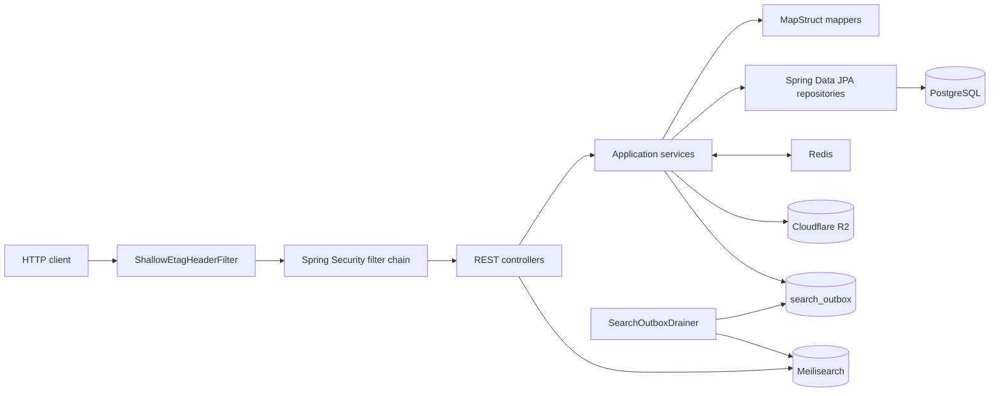
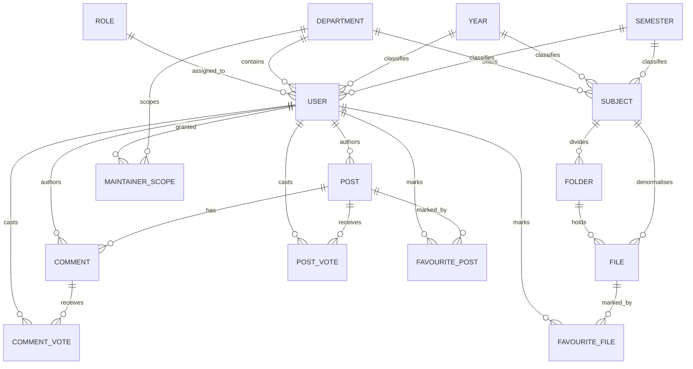

# Documan

Documan is a Java 25 / Spring Boot 4 REST API for organizing academic subjects and files and for supporting a small community around posts, comments, votes, favourites, users, and roles.

The current repository is a single backend service. It stores application data in PostgreSQL, caches response payloads in Redis through Spring's cache abstraction, and stores uploaded file objects in Cloudflare R2 through the AWS S3 SDK.

> Identity is Clerk; this service validates bearer tokens against Clerk's published signing keys and enforces role-based authorization on every write. See [Security model](#security-model) for what is enforced and what is still open.

## Contents

- [Feature inventory](#feature-inventory)
- [Technology stack](#technology-stack)
- [Architecture](#architecture)
- [Repository layout](#repository-layout)
- [Domain model](#domain-model)
- [Local setup](#local-setup)
- [Configuration](#configuration)
- [Database initialization](#database-initialization)
- [API reference](#api-reference)
- [Pagination](#pagination)
- [Error responses](#error-responses)
- [Search](#search)
- [Caching](#caching)
- [File storage](#file-storage)
- [Performance design notes](#performance-design-notes)
- [Security model](#security-model)
- [Observability and logging](#observability-and-logging)
- [Build and development tooling](#build-and-development-tooling)
- [Containerization and CI](#containerization-and-ci)
- [Testing](#testing)
- [Current limitations and known issues](#current-limitations-and-known-issues)
- [License](#license)

## Feature inventory

### Users

- Create a user associated with a department, academic year, semester, and the default regular role.
- Fetch a user by numeric ID or by username; list users with pagination.
- Update a user's profile and academic associations. Your own, or anyone's with an administrator's token.
- Set the terms-of-service, posting and commenting flags through the update payload.
- Delete a user. Deleting a user who still owns posts or comments fails with `409` rather than destroying their content.
- Paginated views of a user's posts, comments, subjects, favourite posts, favourite files, and upvoted/downvoted posts and comments.

### Academic catalog

- Read departments, academic years, semesters, and roles.
- Create, read, update, delete, and list subjects with pagination.
- Filter subjects by department, year, and semester.
- Mark subjects as lab and/or theory subjects.

### Posts and comments

- Create, read, update, delete, and list posts and comments, all paginated.
- List posts by author; list comments by author or by post.
- Upvote or downvote posts and comments; switching direction moves the existing vote rather than adding a second one.
- Casting the same vote twice, or withdrawing a vote that was never cast, is a no-op rather than an error.
- Favourite and unfavourite posts and files.
- Vote and favourite tallies are denormalised counters maintained by atomic SQL updates.
- Deleting a post removes its comments, votes and favourites.

### Files

- Upload multipart files to a Cloudflare R2 bucket, streamed directly from the request.
- Object keys are a random UUID prefix plus a sanitised, length-capped form of the original filename.
- Store file metadata in PostgreSQL; a failed metadata write removes the already-uploaded object.
- List files for a subject with pagination.
- Delete removes both the R2 object and its database row.

### Search

- Full-text search over files. Subjects, posts and comments were indexed too and never queried; they were removed before release.
- Faceted filtering by department, year, semester, subject, file extension and lab/theory.
- The index is updated from the same transaction as the change, so it never shows something that
  was rolled back and never misses something that committed.
- Search being unavailable never fails a write.

### Infrastructure and operations

- PostgreSQL persistence through Spring Data JPA and Hibernate 7.
- Redis-backed response caching with per-cache TTLs via Spring's cache abstraction.
- Virtual-thread request handling.
- Meilisearch-backed full-text search kept in step with the database by a transactional outbox.
- HTTP/2, response compression, and `ETag`/`If-None-Match` on API reads.
- OpenAPI 3.1 specification (`openapi.json`), generated from the controller signatures and verified in CI.
- Spring Boot Actuator and Prometheus registry dependencies.
- OpenTelemetry Java agent in the container image, pinned and checksum-verified.
- Nix flake development shell with Java 25, Maven, Gradle, and supporting tools.
- Spotless formatting with Google Java Format.

## Technology stack

| Area | Current implementation |
| --- | --- |
| Language | Java 25 |
| Framework | Spring Boot 4.1.0 (Spring Framework 7) |
| Web | Spring MVC / `spring-boot-starter-web`, virtual threads enabled |
| Persistence | Spring Data JPA, Hibernate 7.4 |
| Database | PostgreSQL 17 in the provided development Compose file |
| Cache | Spring Cache over Spring Data Redis, Redis 7.4 in the development Compose file |
| Search engine | Meilisearch v1.52 in the development Compose file |
| Object storage | Cloudflare R2 via AWS SDK for Java S3 2.51.0 |
| API documentation | `openapi.json` (OpenAPI 3.1), generated from the controllers |
| Security | `spring-boot-starter-security` + `spring-boot-starter-oauth2-resource-server`; Clerk-issued JWTs, `@PreAuthorize` role and scope checks |
| Serialization | Jackson 3 |
| DTO mapping | MapStruct 1.6.3 |
| Validation | Jakarta Bean Validation via `spring-boot-starter-validation` |
| Search | Meilisearch via meilisearch-java 0.21.0 |
| Boilerplate reduction | Lombok |
| Metrics | Spring Boot Actuator and Micrometer Prometheus registry |
| Tracing in container | OpenTelemetry Java agent 2.9.0 |
| Build | Maven |
| Formatting | Spotless 3.9.0 with Google Java Format 1.36.1 |
| Testing | JUnit 5, AssertJ, Mockito, Testcontainers 2 |
| Local environment | Nix flake / direnv, or a manually installed JDK 25 and Maven |

## Architecture

Documan is a layered Spring monolith. It is **not** a Clean or hexagonal architecture, and this
section says so plainly rather than borrowing the vocabulary.

Judged against the Dependency Rule — source dependencies pointing inward, business rules ignorant of
frameworks and databases — it satisfies two of the seven usual checks:

| Question | Answer |
| --- | --- |
| Can business rules be tested without a database or framework? | No. Service tests need Testcontainers and a real PostgreSQL. |
| Do all source dependencies point inward? | No. Services import Spring Data repositories; entities carry `@Entity`. |
| Can the database be swapped without touching business logic? | No. The entities *are* the schema, and the search outbox uses PostgreSQL-only `ON CONFLICT` and `LEAST`. |
| Are the use cases independent of the delivery mechanism? | **Yes.** Services take request records and return response records; nothing below the controllers knows about HTTP. |
| Is the framework confined to the outermost layer? | No. `@Transactional`, `@Cacheable` and `@Entity` are throughout. |
| Is the component graph free of cycles? | **Yes.** Controllers depend on services, services on repositories, and nothing points back. |
| Does a composition root wire the dependencies? | No. Spring's component scan does. |

That is a deliberate trade, not an oversight. Persistence, caching and search are the substance of
this application rather than swappable details — there is no second database in its future, and the
boundary that would let one exist would cost an interface and an adapter per repository to protect
against a change nobody expects. What the two passing rows buy is the thing worth having: the
services can be read and tested without a web server, and a dependency cycle cannot creep in.

The costs are real and land in two places. Business rules cannot be tested without Docker, which is
why the suite is slower than it looks and why a Docker outage reads as a wall of test failures. And
`ddl-auto: update` means the JPA entities are the schema, so a rename is a hand-written migration.

### Where complexity is hidden, and where it is not

Two modules carry the weight and earn it. Both present a small interface over an implementation you
would not want to write twice:

- **`CurrentUser`** — three methods (`find`, `require`, `requireId`) over token-to-row resolution,
  first-request provisioning, a genuine insert race between the several requests a signed-in page
  load fires at once, and rebinding an account whose Clerk subject changed.
- **`Permissions`** — `mayEditFolder(folderId)` hides a rank comparison, a maintainer-scope lookup,
  a walk from folder to subject to department, and the read transaction all of that needs.

One module does not. **`FileRecorder`** is two methods that mostly forward to repositories — close to
the pass-through that a design review should reject. It exists because `@Transactional` is applied by
a proxy, so a self-call inside `FileService` would be silently ignored, and the R2 upload has to sit
*outside* the transaction rather than holding a pooled connection for the length of a network
transfer. The functionality it provides is a transaction boundary: invisible, but the reason the
connection pool survives someone uploading a folder.

One piece of knowledge is genuinely duplicated, and it is worth knowing about before you change
either copy. The role ordering lives in `RoleName` here and in `ROLE_RANK` in the client's `api.ts`.
Neither can read the other, so the two lists have to be edited together — a gate the interface offers
and the service refuses is worse than either alone.

### Layer diagram


```mermaid
flowchart LR
    Client[HTTP client]
    Etag[ShallowEtagHeaderFilter]
    Security[Spring Security filter chain]
    Controllers[REST controllers]
    Services[Application services]
    Mappers[MapStruct mappers]
    Repositories[Spring Data JPA repositories]
    Cache[Redis]
    Database[(PostgreSQL)]
    R2[(Cloudflare R2)]

    Client --> Etag
    Etag --> Security
    Security --> Controllers
    Controllers --> Services
    Services --> Mappers
    Services --> Repositories
    Repositories --> Database
    Services <--> Cache
    Services --> R2
    Services --> Outbox[(search_outbox)]
    Drainer[SearchOutboxDrainer] --> Outbox
    Drainer --> Meili[(Meilisearch)]
    Controllers --> Meili
```

### Layers

| Layer | Package | Responsibility |
| --- | --- | --- |
| Application entry point | `com.documan` | Sets the JVM default timezone to UTC and starts Spring Boot. |
| HTTP controllers | `com.documan.controllers` | Maps `/api/v1/**`, binds and validates request records, and returns response records. No exception handling. |
| DTOs | `com.documan.dto` | Request and response records; the API contract is decoupled from the persistence model. |
| Mappers | `com.documan.mapper` | MapStruct entity-to-response conversions, generated at compile time. |
| Services | `com.documan.service` | Transaction boundaries, business rules, caching, voting, favourites, and file orchestration. |
| Repositories | `com.documan.dao` | Spring Data repositories with entity graphs, pagination and atomic counter updates. |
| Entities | `com.documan.entity` | JPA model, relationships, indexes, optimistic locking and denormalised tallies. |
| Configuration | `com.documan.config` | Cache manager, web filters and the R2-compatible S3 client. |
| Security | `com.documan.security` | The resource-server filter chain, token-to-row resolution (`CurrentUser`) and every authorisation rule (`Permissions`). |
| Search | `com.documan.search` | Meilisearch gateway, documents, the dirty-set outbox and the query side. |
| Exceptions | `com.documan.exception` | Domain exceptions and the RFC 9457 `@RestControllerAdvice`. |

### Codebase size

- 129 Java main source files, 14 test source files.
- 15 JPA entities, plus a sealed `Votable` interface and the `VoteType` and `DefaultFolder` enums.
- 15 Spring Data repositories.
- 14 service classes.
- 12 REST controllers. The endpoint total is not written down here because it was wrong twice; [`API.md`](API.md) is generated from the controllers and counts them for you.
- 8 MapStruct mappers, one per aggregate, and a DTO record for every request and response shape.
- Most tests need a container runtime. The ones that do not are the pure unit tests and the MockMvc
  slices — anything extending `AbstractDataTest` starts PostgreSQL. The count is deliberately not
  written down here; `mvn test` counts them, and every number in this list that was maintained by
  hand has been wrong at least once.
## Repository layout

```text
.
├── SQL/                          Reference/seed data and one-off migration scripts
├── src/main/java/com/documan/
│   ├── config/                   Cache manager, web filters, R2 client
│   ├── controllers/              REST API controllers
│   ├── dao/                      Spring Data JPA repositories
│   ├── dto/request/              Validated request records
│   ├── dto/response/             Response records and the pagination envelope
│   ├── entity/                   JPA entities, join entities, sealed Votable, VoteType
│   ├── exception/                Domain exceptions and the ProblemDetail advice
│   ├── mapper/                   MapStruct entity to response mappers
│   ├── search/                   Meilisearch gateway, documents, outbox, query side
│   ├── security/                 Resource-server chain, CurrentUser, Permissions
│   ├── service/                  Business, cache, vote, favourite, file, and R2 services
│   └── DocumanApplication.java   Application entry point
├── src/main/resources/
│   ├── application.yml           Shared configuration, applied on every profile
│   ├── application-documan.yml   Checked-in development configuration template
│   └── logback.xml               Console and profile-specific file logging
├── src/test/java/com/documan/    Service tests on Testcontainers PostgreSQL, MockMvc tests
├── Dockerfile                    Multi-stage, layered, non-root application image
├── openapi.json                  OpenAPI 3.1 specification, generated from the controllers
├── schema.sql                    Schema generated from the JPA mapping
├── extract-schema-sql.sh         Regenerates schema.sql
├── pom.xml                       Maven build and dependency configuration
├── flake.nix                     Reproducible development shell
├── Makefile                      Formatting and pre-commit setup commands
```

## Domain model


```mermaid
erDiagram
    ROLE ||--o{ USER : assigned_to
    DEPARTMENT ||--o{ USER : contains
    DEPARTMENT ||--o{ SUBJECT : offers
    YEAR ||--o{ USER : classifies
    YEAR ||--o{ SUBJECT : classifies
    SEMESTER ||--o{ USER : classifies
    SEMESTER ||--o{ SUBJECT : classifies
    USER ||--o{ POST : authors
    USER ||--o{ COMMENT : authors
    POST ||--o{ COMMENT : has
    SUBJECT ||--o{ FOLDER : divides
    FOLDER ||--o{ FILE : holds
    SUBJECT ||--o{ FILE : denormalises
    USER ||--o{ MAINTAINER_SCOPE : granted
    DEPARTMENT ||--o{ MAINTAINER_SCOPE : scopes

    USER ||--o{ POST_VOTE : casts
    POST ||--o{ POST_VOTE : receives
    USER ||--o{ COMMENT_VOTE : casts
    COMMENT ||--o{ COMMENT_VOTE : receives
    USER ||--o{ FAVOURITE_POST : marks
    POST ||--o{ FAVOURITE_POST : marked_by
    USER ||--o{ FAVOURITE_FILE : marks
    FILE ||--o{ FAVOURITE_FILE : marked_by
```

### Entities

| Entity | Table | Notes |
| --- | --- | --- |
| `Role` | `role` | Four rows: `regular`, `maintainer`, `moderator`, `admin`. **Rank is by name, not by id** — see `RoleName`. Rank was the id until `maintainer` was added fourth and would have outranked `admin`; the id is a surrogate key that no behaviour reads. |
| `Department`, `Year`, `Semester` | `department`, `year`, `semester` | Reference tables. |
| `User` | `documan_user` | Profile, academic associations, account flags, `@Version`. |
| `Subject` | `subject` | Lab/theory flags, composite index on department/year/semester. |
| `Post` | `post` | Content plus `upvote_count`, `downvote_count`, `favourite_count`, `@Version`. |
| `Comment` | `comment` | Content plus `upvote_count`, `downvote_count`, `@Version`. |
| `File` | `file` | Object key and URL, size, `favourite_count`, `@Version`. Belongs to a folder *and* denormalises its subject. |
| `Folder` | `folder` | A named division of a subject — the unit or lab a file is filed under. Created from `DefaultFolder` slugs (`unit-1`…`unit-5`, `lab`, `coursefiles`) or by hand. Every file lives in one, which is why upload takes a `folderId` rather than a `subjectId`. |
| `MaintainerScope` | `maintainer_scope` | One grant of part of the library to a maintainer: a department, optionally a year within it, optionally a semester within that. A null column means "all of them". Grants add up rather than intersect. |
| `PostVote`, `CommentVote` | `post_vote`, `comment_vote` | One row per (target, user); direction in a `vote_type` column. |
| `PostFavourite`, `FileFavourite` | `favourite_post`, `favourite_file` | One row per (target, user). |

`Post` and `Comment` implement the sealed `Votable` interface, so code that reads tallies dispatches
with an exhaustive pattern-matching switch instead of unchecked casts.

### Referential policy

- Votes and favourites cascade with their target at the database level (`ON DELETE CASCADE`), because
  they are derived data.
- Comments cascade with their post.
- Authored content does **not** cascade with its author. Deleting a user who still has posts or
  comments fails and is surfaced as `409 Conflict`.

## Local setup

### Prerequisites

- JDK 25 and Maven, or the provided Nix flake shell (`nix develop`, or `direnv allow`).
- Docker or Podman for PostgreSQL, Redis and Meilisearch.

### Two commands

```bash
make up     # PostgreSQL, Redis and Meilisearch via ../docker-compose.datastores.yml
make dev    # mvn spring-boot:run -Pdev
```

That is a complete working application on `http://localhost:8080`. `make up` prints each
container's health; wait for all three to report `healthy` before starting the app.

`make down` stops the stack, `make logs` tails it, and `make reset` removes it along with its data
volumes so the next `up` starts from an empty database.

### Profiles

The active Spring profile is written in at build time from the Maven profile, so the two cannot
drift apart:

| Maven profile | Spring profile | Configuration | Use |
| --- | --- | --- | --- |
| `default` | `documan-secrets` | `application-documan-secrets.yml` (gitignored) | Real credentials |
| `dev` | `dev` | `application-dev.yml` (**gitignored**; copy `application-dev.yml.example`) | The Compose stack above |
| `test` | `test` | supplied by the environment | CI / staging |
| `production` | `production` | supplied by the environment | Deployment |

`application-dev.yml` holds no secrets — it points at the Compose services and every value falls
back to an environment variable, so the same profile works against a stack that is not on
localhost:

```bash
DB_HOST=db.internal MEILI_HOST=http://search.internal:7700 mvn spring-boot:run -Pdev
```

The R2 settings in that profile are deliberate placeholders rather than credentials. The
application needs those properties to start, and without defaults nobody could run it without an R2
account — which would block anyone working on search, posts or comments. File upload and delete
fail until real values are supplied; everything else works. Export `R2_ACCESS_KEY_ID`,
`R2_SECRET_ACCESS_KEY`, `R2_ENDPOINT`, `R2_FILES_BUCKET` and `R2_FILES_PUBLIC_URL` to exercise them.

`application-documan.yml` is the checked-in template for the gitignored secrets file, not a profile
you run:

```bash
cp src/main/resources/application-documan.yml \
   src/main/resources/application-documan-secrets.yml
```

## Configuration

Shared configuration lives in `application.yml` and applies on every profile. Datastore
credentials and R2 settings live in the profile-specific file.

### Performance-relevant settings

| Property | Value | Why |
| --- | --- | --- |
| `spring.threads.virtual.enabled` | `true` | The workload is I/O bound; a blocked request no longer pins an OS thread. |
| `server.tomcat.threads.max` | `50` | Request handling runs on virtual threads, so the platform pool only backs Tomcat's own work. |
| `spring.jpa.open-in-view` | `false` | Prevents lazy associations initialising during response rendering. |
| `spring.jpa.properties.hibernate.jdbc.batch_size` | `50` | Batches inserts and updates. |
| `spring.jpa.properties.hibernate.query.fail_on_pagination_over_collection_fetch` | `true` | Turns silent in-memory pagination into an error. |
| `spring.data.redis.lettuce.pool.*` | enabled | Without a pool, Lettuce serialises all command dispatch over one connection. |
| `spring.datasource.hikari.maximum-pool-size` | `50` | The real concurrency limit for database work. Keep in step with the server's `max_connections`. |
| `spring.datasource.hikari.leak-detection-threshold` | `30000` | 2s flagged any slow query as a leak and produced a stack trace per occurrence. |
| `server.http2.enabled` | `true` | Multiplexing for clients that negotiate it. |
| `server.compression` | `application/json`, `application/problem+json` | Responses over 1&nbsp;KB. |
| `spring.servlet.multipart.max-request-size` | `30MB` | Previously unset, leaving total request size unbounded. |
| `documan.search.outbox.counter-debounce` | `60s` | Collapses vote storms into one index push per entity. |
| `documan.search.reconcile.cron` | every 6h | Full convergence sweep; enqueues only, so it costs four inserts. |

## Database initialization

The application owns the schema through `spring.jpa.hibernate.ddl-auto: update`. Start the
application once against an empty database and the tables are created.

### Reference and sample data

```bash
cd SQL && ./load-data.sh
```

This loads roles, years, semesters, departments, and sample subject/user/post/comment rows.
Role ids matter: `UserService` assigns role 1 to new accounts.

### Schema reference

`schema.sql` is generated from the JPA mapping rather than dumped from a live database, so it
cannot drift from the entities:

```bash
./extract-schema-sql.sh
```

Pass `--from-database` to dump a running container instead.

## API reference

The full contract is in [`openapi.json`](openapi.json), and [`API.md`](API.md) is a readable
rendering of it — every endpoint with the parameters it requires and who is allowed to call
it. Both are generated; neither is edited by hand. Identifiers are query parameters; all
collection endpoints are paginated.

| Method | Path | Purpose |
| --- | --- | --- |
| `GET` | `/api/v1/user?userId=` | Fetch a user |
| `GET` | `/api/v1/user/username?username=` | Fetch a user by username |
| `GET` | `/api/v1/user/all` | List users |
| `POST` | `/api/v1/user` | Create a user (`201`) |
| `PUT` | `/api/v1/user?userId=` | Update a user |
| `DELETE` | `/api/v1/user?userId=` | Delete a user (`204`) |
| `GET` | `/api/v1/user/posts?userId=` | Posts by a user |
| `GET` | `/api/v1/user/comments?userId=` | Comments by a user |
| `GET` | `/api/v1/user/subjects?userId=` | Subjects for the user's department/year/semester |
| `GET` | `/api/v1/user/favourites/posts?userId=` | Favourited posts |
| `GET` `POST` | `/api/v1/user/favourites/files` | Favourited files; favourite a file |
| `POST` | `/api/v1/user/favourites/files/remove` | Unfavourite a file |
| `GET` | `/api/v1/user/votes/posts?userId=&voteType=` | Posts voted in a direction |
| `GET` | `/api/v1/user/votes/comments?userId=&voteType=` | Comments voted in a direction |
| `GET` | `/api/v1/post?postId=` | Fetch a post |
| `GET` | `/api/v1/post/all` | List posts, newest first |
| `GET` | `/api/v1/post/user?userId=` | Posts by author |
| `POST` `PUT` `DELETE` | `/api/v1/post` | Create (`201`), update, delete (`204`) |
| `POST` | `/api/v1/post/vote`, `/api/v1/post/vote/remove` | Cast, switch or withdraw a vote |
| `POST` | `/api/v1/post/favourite`, `/api/v1/post/favourite/remove` | Favourite handling |
| `GET` | `/api/v1/comment?commentId=` | Fetch a comment |
| `GET` | `/api/v1/comment/all`, `/user`, `/post` | List comments |
| `POST` `PUT` `DELETE` | `/api/v1/comment` | Create (`201`), update, delete (`204`) |
| `POST` | `/api/v1/comment/vote`, `/api/v1/comment/vote/remove` | Vote handling |
| `GET` | `/api/v1/subject?subjectId=`, `/all`, `/semester` | Subject reads |
| `POST` `PUT` `DELETE` | `/api/v1/subject` | Subject writes |
| `GET` | `/api/v1/file/subject?subjectId=` | Files for a subject |
| `POST` `DELETE` | `/api/v1/file` | Upload (`201`), delete (`204`) |
| `GET` | `/api/v1/role`, `/all`, `/user` | Role reads |
| `PUT` | `/api/v1/role/promote`, `/api/v1/role/demote` | Change a user's role |
| `GET` | `/api/v1/department/all`, `/api/v1/year/all`, `/api/v1/semester/all` | Reference lookups |
| `GET` | `/api/v1/search/files` | Full-text search (see [Search](#search)) |

### Vote semantics

`voteType` binds to the `VoteType` enum (`UPVOTE`, `DOWNVOTE`); an unknown value is rejected at
binding time with `400`. Voting is idempotent: casting the same direction twice leaves the tallies
unchanged, casting the opposite direction moves the vote, and withdrawing a vote that was never cast
or that pointed the other way is a no-op.

## Pagination

Collection endpoints accept standard Spring Data parameters and return a stable envelope rather
than a serialised `Page`:

```text
?page=0&size=20&sort=dateCreated,desc
```

Default page size is 20 (30 for users, 50 for subjects and files); the maximum is 100.

```json
{
  "content": [],
  "page": 0,
  "size": 20,
  "totalElements": 0,
  "totalPages": 0,
  "first": true,
  "last": true
}
```

An empty result is an empty page, not a `404`.

## Error responses

Errors are RFC 9457 problem documents served as `application/problem+json`:

```json
{
  "type": "https://documan.dev/problems/not-found",
  "title": "Resource not found",
  "status": 404,
  "detail": "Post 42 was not found",
  "instance": "/api/v1/post",
  "timestamp": "2024-10-28T00:00:00Z"
}
```

Validation failures add a field-keyed `errors` object:

```json
{
  "type": "https://documan.dev/problems/validation",
  "title": "Validation failed",
  "status": 400,
  "detail": "One or more fields failed validation",
  "errors": { "title": "must not be blank" }
}
```

| Status | Raised by |
| --- | --- |
| `400` | Bean Validation failure, unbindable parameter, invalid role transition |
| `404` | `ResourceNotFoundException` |
| `409` | Uniqueness conflict, referential conflict, optimistic-locking failure |
| `502` | Object-store failure |
| `503` | Search unavailable; includes `Retry-After` |
| `500` | Anything unhandled; logged with the request method and URI |

## Search

Full-text search runs on Meilisearch. One index is maintained: `documan_files`.

| Index | Searchable | Filterable | Sortable |
| --- | --- | --- | --- |
| files | name, extension, subjectName, subjectCode | extension, subjectId, departmentId, yearId, semesterId, lab, theory | name, size, favouriteCount, dateCreated |

Subjects, posts and comments were indexed too and never queried; they were removed before release.
An index nobody reads still costs a document build and a push on every write to the entity behind
it, and voting is the hottest write path in the service. The outbox machinery below is
aggregate-agnostic, so a second index is an entry in `SearchIndex`, one in `AggregateType` and a
branch in `DocumentFactory`.

Timestamps are indexed as epoch seconds so ranges and sorting work numerically.

### Keeping the index truthful

The index is a second copy of the data, so the hard part is not writing to it but never letting it
disagree with PostgreSQL. Three properties are required, and each dictates part of the design.

**Nothing rolled back may ever be indexed.** A change enqueues a row in `search_outbox` inside the
same transaction as the entity write. If the transaction rolls back, so does the enqueue.

**Nothing committed may ever be missed.** The row stays until Meilisearch confirms the work, so a
crash between commit and indexing is recovered by the next sweep. This is also why the drainer waits
for the Meilisearch *task* rather than trusting the HTTP response: `addDocuments` returns 202
meaning "queued", and treating that as success would silently lose anything whose task later failed.

**Indexing must never fail a write.** The only search work inside a request transaction is a local
insert. Nothing on the request path opens a socket to Meilisearch, and the post-commit trigger is a
non-blocking signal rather than a synchronous listener.

### The outbox is a set, not a queue

There is at most one row per `(aggregate_type, aggregate_id)`, upserted with `ON CONFLICT`. Because
the drainer re-reads current state before pushing, the *reason* a key became dirty carries no
information — presence at read time is the whole decision:

- row present → upsert the document
- row absent → delete the document

That is why there is no `operation` column and no ordering to preserve. It also bounds the table by
distinct entities rather than by write volume, which matters because voting is the busiest write
path in the service. A `dirty_seq` counter, checked when the row is cleared, means a change
committed while a push was in flight is retried rather than dropped.

### Capture

Changes are captured by a JPA `@EntityListeners` callback into a transaction-scoped buffer, written
in `beforeCommit`. Lifecycle callbacks rather than a call in each mutating service method, because
`PostService.delete` removes comments via a JPA cascade — `CommentService.delete` is never invoked,
so a hand-written hook there would leak orphaned comment documents on every post deletion.

Two things bypass Hibernate and so are enqueued explicitly:

- the four `@Modifying` counter updates, which are debounced by 60s so a vote storm on one entity
  collapses into a single push. A genuine edit arriving meanwhile pulls the entity forward.
- fan-outs, where one entity's change invalidates another's denormalised copy. Renaming a subject
  refreshes every file that embeds its name; renaming a user refreshes their posts and comments.
  Both are guarded by comparing the old and new values, so a save that changes nothing does not
  re-push anything, and both are single set-based statements rather than ids pulled into the JVM.

### Scheduled reconcile

Every six hours (`documan.search.reconcile.cron`) a job marks every indexed row dirty, so the index
converges on the database even if a change was missed — a poison-message key, an out-of-band
`UPDATE`, or an index that was lost entirely.

It is cheap because it does not talk to Meilisearch at all. It runs four set-based
`INSERT ... SELECT` statements into the outbox and lets the drainer do the pushing, inheriting the
existing batching, retry and backpressure. The job itself finishes in milliseconds regardless of
table size; the indexing cost is spread over subsequent drain cycles.

It is an upsert, not a rebuild — clearing the indexes first would make search return nothing until
the rebuild finished, whereas re-pushing over a live index keeps it serving throughout. One replica
wins a transaction-scoped advisory lock and does the enqueue; the rest skip it.

The same job is the bootstrap path: point the application at a populated database and an empty
Meilisearch, and a reconcile fills the index.

Unlike the incremental path, a reconcile resets `attempts`, so a key that had exhausted its retry
budget gets another chance every six hours instead of staying dead forever.

Cost is dominated by re-tokenising post and comment text, which is why documents cap `content` at
32 KB; subjects and files are tiny by comparison. Set `documan.search.reconcile.enabled: false` to
turn it off.

### Failure behaviour

Transport failures (unreachable, timeout, 5xx) pause the cycle and leave rows untouched — consuming
the retry budget during an outage would dead-letter the whole backlog moments before Meilisearch
came back. Only document-level rejections count against `max-attempts`, with exponential backoff. A
key that exhausts its budget stops being claimed and stays in the table as the record of what broke.

Search endpoints return `503` with `Retry-After` when Meilisearch is down. A circuit breaker fails
fast after three consecutive transport failures rather than waiting on a socket each time.

Setting `documan.search.enabled: false` removes the client, the drainer and the search endpoints,
and makes the capture layer a no-op.

### Facet parity with the old Flask app

The archived application also filtered on `type` (`UNIT - 1..5` / `Theory` / `Lab`) and
`is_coursefile`. The rewritten `File` entity has no such columns — that taxonomy was lost in the
port — so those two facets are not available. `extension` is derived from the filename, so it is available; restoring the other two means adding
columns to `file` first.

## Caching

Caching goes through Spring's cache abstraction backed by `RedisCacheManager`.

| Cache | Payload | TTL |
| --- | --- | --- |
| `users`, `posts`, `comments` | `UserResponse`, `PostResponse`, `CommentResponse` | 10 minutes |
| `subjects`, `departments`, `years`, `semesters`, `roles` | corresponding response records | 6 hours |

Keys are prefixed `documan:`. Each cache holds exactly one type and gets a concretely typed
`JacksonJsonRedisSerializer`, which keeps polymorphic type hints out of the payload and avoids
opening a deserialization gadget surface.

Cached values are **response records, not JPA entities**, which removes the lazy-loading and Jackson
back-reference hazards of caching managed entities.

Reads populate the cache; writes replace the entry through `@CachePut`; deletes, votes, favourites
and role changes evict it.

## File storage

`CloudflareR2Config` builds a synchronous S3 client with static credentials, the configured endpoint
override, path-style access, and region `auto`.

`CloudflareR2Service` moves bytes; `FileService` owns metadata and orchestration.

### Upload sequence

1. Verify the subject exists.
2. Build an object key: a random UUID prefix, then the original filename sanitised to
   `[A-Za-z0-9._-]`, lower-cased and capped at 180 characters.
3. Stream the multipart part straight to R2 with its content type and length.
4. Persist name, object key, public URL, size and subject.
5. If the metadata write fails, delete the uploaded object so nothing is orphaned.

### Delete sequence

1. Look up the metadata row by object key; `404` if absent.
2. Delete the object from R2.
3. Delete the metadata row.

`cloudflare.r2.public-read-acl` controls whether the `PUBLIC_READ` canned ACL is sent. R2 does not
implement S3 ACLs — public exposure is a bucket or custom-domain setting — so set it to `false`
unless an existing bucket depends on the header.

## Performance design notes

### Votes and favourites

Previously each vote loaded `post.upvotedUsers` and `post.downvotedUsers` in full — every user who
had ever voted on that post — mutated the in-memory collections, and let Hibernate diff them. Cost
grew with the number of existing voters.

Now a vote touches two rows: an upsert into a join table, and one atomic
`UPDATE post SET upvote_count = upvote_count + ?`. Neither scales with existing voters, and the
counter update cannot lose a concurrent write because it never round-trips through the entity.
A unique constraint on `(post_id, user_id)` makes duplicate votes impossible at the database level.

### Query shape

- `@EntityGraph` fetches a post's or comment's author in the same statement; list endpoints
  previously issued one extra select per row.
- `@BatchSize` on the post-to-comments collection.
- Derived queries replace the hand-written native SQL.
- Every collection endpoint is paginated; nothing returns an unbounded list.

### Other

- Virtual threads for request handling, with the servlet pool sized down accordingly.
- One shared serializer instance per cache, rather than an `ObjectMapper` allocated per cache read
  and write.
- `ETag`/`If-None-Match` on `/api/*` reads.
- Optimistic locking (`@Version`) on the mutable entities.

## Security model

### Authentication

Clerk owns identity. This service is an OAuth2 resource server: it validates a bearer JWT against
Clerk's published signing keys and mints nothing itself, so there is no login endpoint, no session
and no server-to-server call to Clerk. Clerk's *secret* key is never used here and must not be
configured — only the issuer and JWK set URIs, which come from the instance's own discovery document
at `<frontend-api>/.well-known/openid-configuration`.

`CurrentUser` turns a validated token into a row, provisioning one on a reader's first request. A row
is matched by Clerk's `sub`, or failing that by verified email — which is what carries an account
across from a pre-Clerk database, and what lets someone back in whose Clerk account was deleted and
recreated under a new subject.

### What the filter chain enforces

- CSRF disabled: it defends a cookie session the browser attaches automatically, and a bearer token
  in an `Authorization` header is not one.
- Stateless sessions.
- `GET` is public, because reading the library should not require an account.
- Everything under `/api/v1/user/**` requires a token whatever the method — those responses are the
  directory, not material.
- Every other non-`GET` requires a valid token.

### What the annotations enforce

Authorization is `@PreAuthorize` on the controller methods, evaluated against `Permissions`. Roles
rank — `regular` < `maintainer` < `moderator` < `admin` — and each check asks "at least this rank",
so an administrator is implicitly a moderator too.

| Who | May |
| --- | --- |
| `admin` | Promote and demote, grant and revoke maintainer scopes, delete users, flag announcements |
| `moderator` | The user directory, `canPost`/`canComment` grants, any post or comment, the whole library |
| `maintainer` | Upload, move, rename and delete files, folders and subjects — **only within their granted department/year/semester** |
| signed in | Their own profile, votes and favourites; posts and comments they wrote |

A maintainer's right is not "edit the library" but "edit one address in it", which is why this is a
bean rather than `hasRole`: the question cannot be answered without the folder or file in hand. It is
also why the role is not mapped to a `ROLE_*` authority — the role is a database column rather than a
token claim, so an authority would mean a database read inside the filter chain on every anonymous
`GET`, which is most of this service's traffic.

`EveryWriteIsAuthorisedTest` fails the build if any `POST`, `PUT`, `PATCH` or `DELETE` is added
without a rule. It says nothing about whether a rule is the *right* one — only that somebody decided.

### Known gaps

- **`?userId=` still names the actor** on several write endpoints. Where it matters it is pinned to
  the caller (`@permissions.isSelf(#userId)` on posts, comments, votes and favourites), so it can no
  longer be used to act as somebody else. Removing the parameter entirely is the cleaner fix and has
  not been done.
- **`documan_user.password` still exists** and is `not null` in the schema. Nothing reads it — there
  is no `PasswordEncoder` or `UserDetailsService` anywhere — but the column outlived the sign-up form
  it belonged to.
- **The audience check is off by default.** A Clerk session token carries no `aud` unless the JWT
  template sets one, and the issuer already identifies a single instance belonging to this
  application. Set `documan.auth.audience` and the template's audience together, or leave both empty;
  a value on one side only rejects every request.

## Observability and logging

### Request logging

There is none. A filter that logged every request header and query parameter without redaction was
removed before release: it would have logged bearer tokens and cookies the moment authentication
arrived. Enable Tomcat's access log, or add `ServerHttpObservationFilter` with low-cardinality URI
tags, if request-level visibility is wanted.

### Actuator and metrics

`spring-boot-starter-actuator` and `micrometer-registry-prometheus` are present. No custom health
indicators, metrics, or endpoint exposure settings are configured.

### OpenTelemetry

The container image runs the OpenTelemetry Java agent, pinned to 2.9.0 and verified against a
recorded SHA-256 at build time. Configured environment values cover the OTLP endpoint, resource
attributes, always-on sampling, Micrometer and Logback instrumentation, database statement
sanitisation, a 10s metric export interval, and always-on exemplars.

### Time handling

`DocumanApplication` sets the JVM default timezone to UTC before starting Spring. Timestamps use
Hibernate's `@CreationTimestamp` and `@UpdateTimestamp` with `OffsetDateTime`.

## Build and development tooling

### Maven

```bash
mvn clean verify      # build and run tests
mvn spring-boot:run   # run locally
```

The build targets Java 25, filters `src/main/resources`, and runs Lombok and MapStruct as
annotation processors. MapStruct is configured with `unmappedTargetPolicy=ERROR`, so an unmapped
response field is a compile error rather than a silent null.

Profiles `default`, `dev`, `test` and `production` set `spring.profiles.active`. These match the
values the Dockerfile and CI pass as `--build-arg ENV`, which previously referred to profiles that
did not exist.

### Formatting

```bash
make format          # mvn spotless:apply
make init            # install the pre-commit hook
```

### API specification

`openapi.json` is generated from the controller signatures by `OpenApiExportTest`, so it cannot
drift from the code. Regenerate it with `make openapi` and commit the result; `make verify-generated`
fails when the committed copy is behind.

## Containerization and CI

### Docker image

Multi-stage build:

1. Maven/Temurin 25 resolves dependencies in a cached layer, then packages the application.
2. The jar is split with `-Djarmode=tools ... extract --layers`, so rarely-changing dependencies
   land in a different image layer to the application classes.
3. A separate stage downloads the OpenTelemetry agent and verifies its SHA-256.
4. The runtime image runs as a non-root `documan` user.

`JAVA_OPTS` is expanded by the entrypoint rather than ignored, and sets `MaxRAMPercentage` so the
heap tracks the container limit.

A CDS archive used to be configured here and was removed after measurement. `AutoCreateSharedArchive`
dumps the archive when the JVM exits, and on the target deployment the JVM never finished exiting —
given a 90 second stop grace period it used all of it and was killed, so no archive was ever written.
The flags cost 90 seconds on every stop and bought nothing. Worth revisiting only where the JVM can
be shown to shut down cleanly and quickly.

```bash
docker build \
  --build-arg ENV=dev \
  --build-arg OTEL_ENDPOINT=http://collector:4317 \
  -t documan:local .
```

The runtime image does not include PostgreSQL, Redis, or R2 configuration; supply those through the
deployment environment.

### GitLab CI

A `verify` stage runs `mvn verify` and publishes JUnit reports. The three image build jobs
(`build_dev`, `build_test`, `build_prod`) remain manual but now depend on `verify`, so a broken
build can no longer be published.

## Testing

```bash
mvn verify
```

**The suite requires Docker.** H2 was removed so that every database test runs on the PostgreSQL the
application actually uses — the search outbox depends on `ON CONFLICT` and `LEAST`, which no
in-memory stand-in emulates honestly. PostgreSQL and Redis are shared across the whole suite as
singleton containers; the Meilisearch container starts only for the search tests.

Tests that need no container run anywhere: the pure unit tests (`SearchFilterTest`, `DocumentFactoryTest`), the MockMvc slice (`PostControllerTest`) and the authorisation coverage check (`EveryWriteIsAuthorisedTest`), which reads annotations by reflection. Everything extending `AbstractDataTest` starts PostgreSQL and needs Docker.

| Suite | Covers |
| --- | --- |
| `VoteServiceTest` | Vote tallies, idempotency, direction switching, withdrawal, multi-user accumulation, comment votes, missing-entity handling, sealed-hierarchy dispatch |
| `FavouriteServiceTest` | Post and file favourite idempotency and tallies |
| `DeleteCascadeTest` | Deleting posts and comments that carry votes and favourites |
| `PostAndUserServiceTest` | Pagination envelopes, author fetching without lazy-load failure, empty-page semantics, comment cascade, password preservation on update, account flags, duplicate detection, relationship views |
| `PostControllerTest` | Status codes, validation shape, RFC 9457 bodies, enum binding, pagination envelope |
| `CacheBehaviourTest` | Cache population, `#result.id()` key expressions, replacement on update, eviction on delete and on vote, and that deleting a post no longer disturbs a comment with the same id |
| `SchemaExportTest` | Generates `schema.sql` from the mapping and asserts the expected tables exist and the legacy join tables do not |
| `SearchFilterTest` | Filter-expression escaping, per-index attribute allow-listing, injection attempts (no container) |
| `DocumentFactoryTest` | Extension derivation, content truncation, epoch-second timestamps, denormalised fields (no container) |
| `SearchSyncIntegrationTest` | Create/update/delete reaching the index, subject and username fan-out, the post-delete comment cascade, vote tallies, filters, rollback isolation, outbox durability |

### Removed rather than fixed

Three cases in `SearchSyncIntegrationTest` — file rename, file delete, and the
subject filter — and the whole of `RedisCacheSerializationTest` were deleted to
get a green suite, not because the behaviour stopped mattering. They failed on
test-level problems (a cache test running with `spring.cache.type=none`, and
assertions sensitive to the order contexts are created in) rather than on product
defects. Cache round-tripping and those three search paths are consequently
unverified.

### Not yet covered

- R2 integration against a real S3-compatible service; `S3Client` is mocked.
- Concurrency tests for the atomic counter updates and for two drainers racing.
- Per-role authorization behaviour. `EveryWriteIsAuthorisedTest` proves every write *has* a rule; no test yet proves each rule admits and refuses the right people.

## Current limitations and known issues

### Security

- CSRF is disabled — deliberately; see [Security model](#security-model).
- Development database and Redis passwords are hard-coded defaults in the checked-in template. They
  are development defaults, not credentials: real values come from the environment.
- `documan_user.password` is a dead column that is still `not null`. Nothing reads it and no
  `PasswordEncoder` exists; identity is Clerk's.
- The authorization rules have unit coverage that every write *has* a rule, but no integration test
  that each rule admits and refuses the right people.

### API design

- Identifiers are query parameters rather than path variables.
- `?userId=` still names the actor on some writes. It is pinned to the caller wherever it could be
  abused, but taking the actor from the token everywhere is the cleaner design.

### Persistence

- `ddl-auto: update` is not a controlled migration strategy: it never drops or alters, so
  destructive or renaming changes need a hand-written script.
- Seed scripts are not idempotent.

### Search

- An R2 object deleted directly in the Cloudflare dashboard is not noticed; the reconcile job
  compares the index against PostgreSQL, not against the bucket.
- Department, year and semester names are denormalised into file and subject documents. That is safe
  today because those tables have no application write path; adding one would need a matching
  fan-out.
- Orphan documents — an index entry whose row was removed by out-of-band SQL — are not detected.
  The reconcile job re-pushes what exists but does not diff the index for extras.

### Operations

- Actuator endpoints are not exposed and there are no health indicators for PostgreSQL, Redis or R2.
- The Logback profile blocks declare multiple root loggers at different levels, which is not a
  normal way to combine levels and should be verified.

### File handling

- Uploads are not deduplicated and there is no content-type allowlist or virus scanning.
- Objects are served from a public bucket URL rather than time-limited presigned URLs.
- No reconciliation job for objects orphaned by out-of-band failures.

## License

This project is licensed under the [MIT License](LICENSE).
